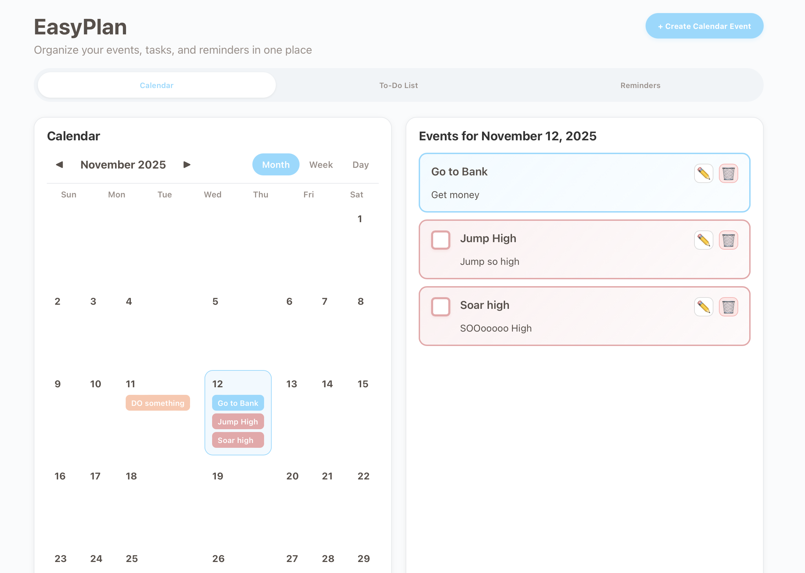
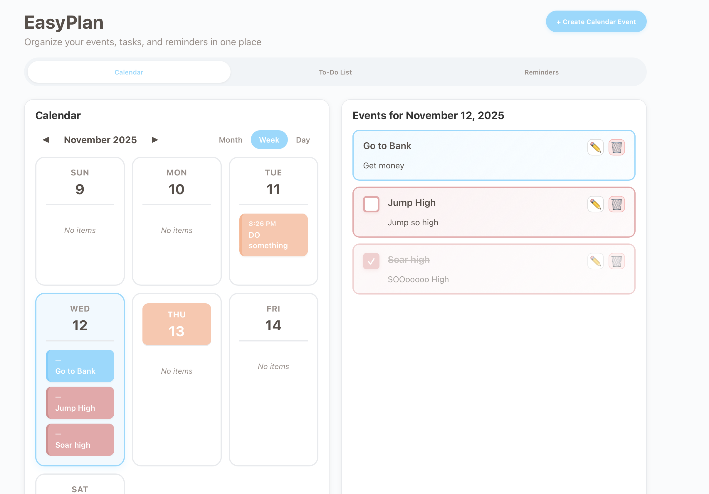
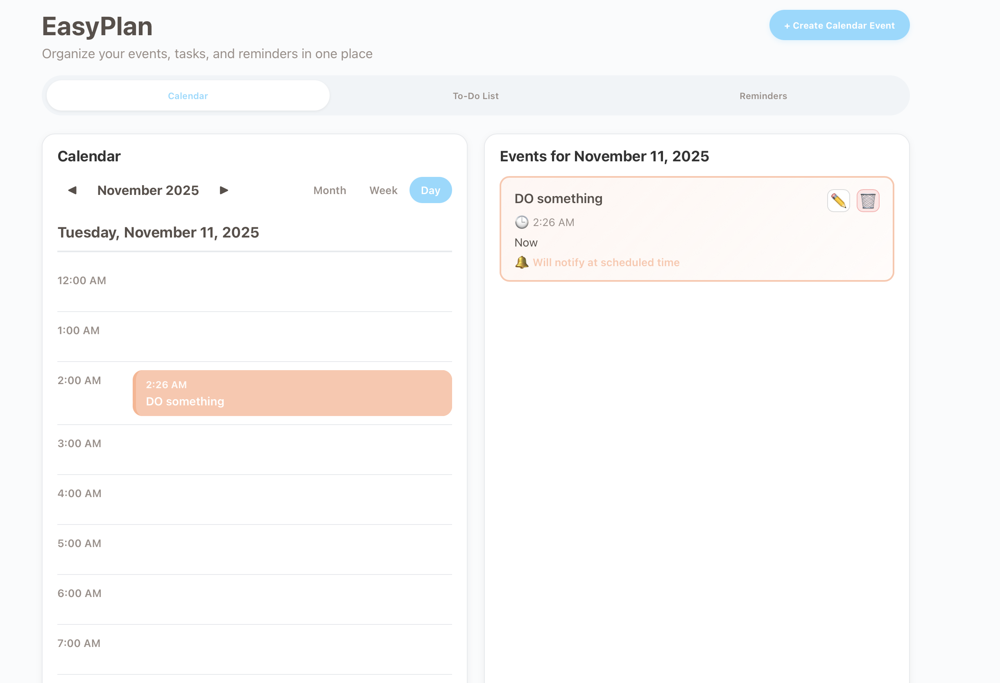
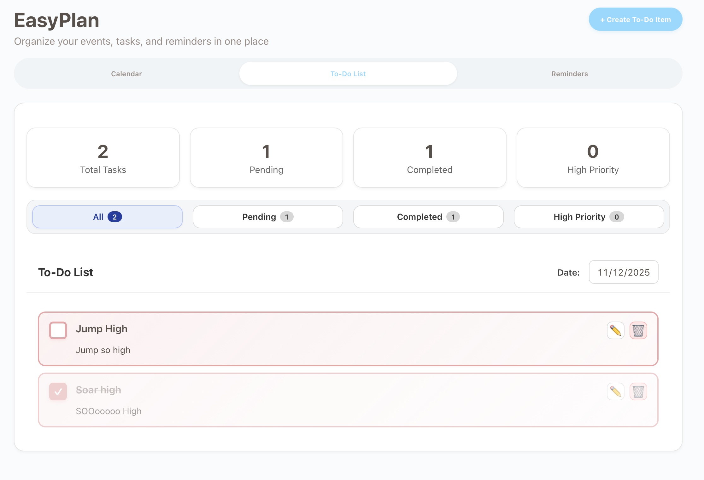
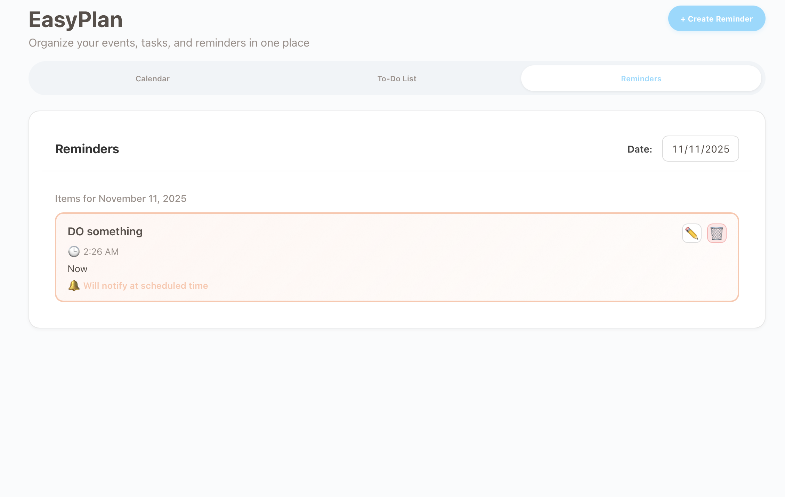
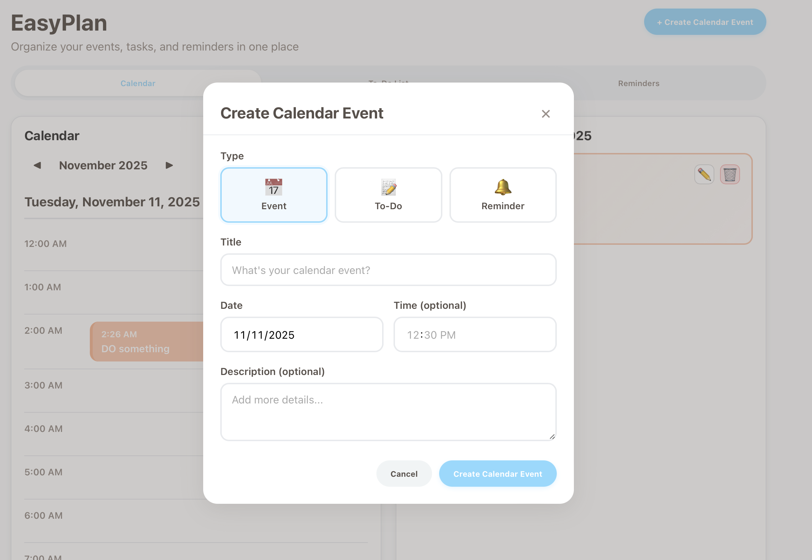

# HCI Calendar App

A simple, friendly calendar and productivity app for students. More powerful than iPhone Notes, less intimidating than Notion.



## Features

**Calendar Views** - Month, week, and day views to organize your schedule.




**To-Do List** - Track tasks with clickable checkboxes.



**Reminders** - Set reminders with audio notifications and snooze functionality.




## Getting Started

```bash
# Ensure Node.Js is downloaded first

# Setup a Vite project to make sure everything needed is downloaded
npm create vite@latest

# Ensure you select "React" framework as well after naming project when prompted
# Ensure you select "JavaScript" for the variant when prompted

# Install dependencies
npm install

# Run the app
npm run dev
```

## Team

Created for Human Computer Interaction at Georgia Southern University by Daniel Troyano, Gabby Duartez, Wade Towns, and Collin Gray.
